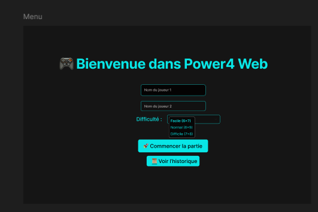
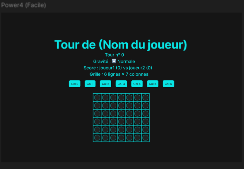
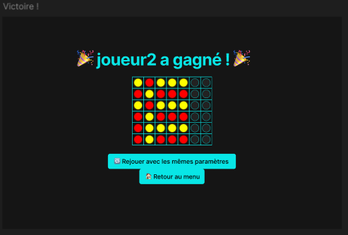
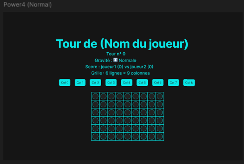
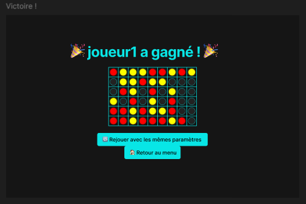
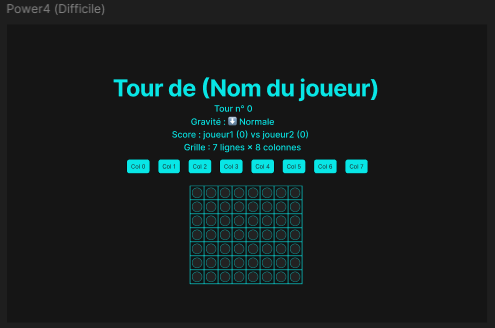
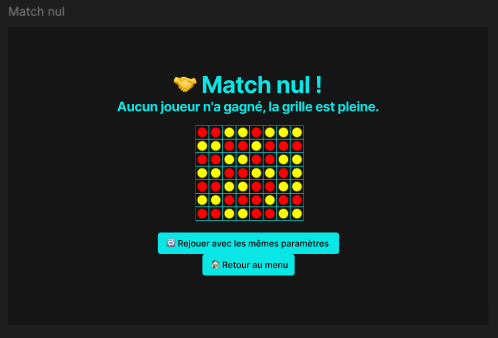
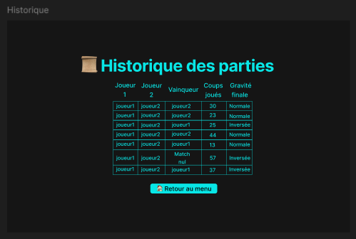

Power4 Web — Jeu Puissance 4 en Go

Bienvenue dans le projet Power4 Web, qui est une application web développée en Go (Golang) qui permet à deux joueurs de s’affronter dans une partie de Puissance 4 sur le même ordinateur, grâce à une interface web simple.

Ce projet est conçu pour être facile à utiliser, même si vous n’avez jamais codé. Chaque étape est expliquée pour que vous puissiez le lancer sans difficultée.

🧠 Objectif du projet:
Créer un serveur web en Go qui va:
Afficher une interface HTML pour jouer à Puissance 4.
Gérer toute la logique du jeu côté serveur.
Permettre de jouer à deux en local.
Proposer plusieurs niveaux de difficulté, de facile a difficile, on aura un changement de taille de la grille.
Ajouter la gravité inversée au bout de 5 tours.
📦 Les prérequis:
Avant de commencer, vous devez avoir :
Go installé sur votre ordinateur : Télécharger Go
Un navigateur web (par exemple: Chrome, Firefox, etc.)
Un terminal (comme: cmd, PowerShell, Terminal Mac/Linux)

Ensuite avant de commencé a coder, il faut faire une maquette pour mettre en forme toute la plupart des idées que nous avons. voici pour ce projet le lien de la maquette, faite sur Figma: 

https://www.figma.com/proto/8WMwHXqFFachqLNXnfm5AL/Power4?node-id=1-1743&t=aq7Mo7ylLUuTa7nb-1

Si vous n'avez eu de mail d'invitation pour de Figma, vous ne pourrez pas utilisez le lien. Voici ce que contient le Figma :

📁 Structure du projet:

Voici les dossiers et fichiers que vous trouverez :

Power4-Web/
├── assets/        # Contient les images de Figma
│   ├── figma_gameDifficile.png
│   ├── figma_gameFacile.png
│   ├── figma_gameNormal.png
│   ├── figma_historique.png
│   ├── figma_match_nul-difficile.png
│   ├── figma_menu.png
│   ├── figma_victoireJ1-normal.png
│   └── figma_victoireJ2-facile.png
├── models/           # Contient la logique du jeu
│   └── game.go
├── static/           # Contient le fichier CSS pour le design
│   └── style.css
├── templates/        # Contient les pages HTML
│   ├── start.html    # Page d’accueil
│   ├── game.html     # Page du jeu
│   ├── win.html      # Page de victoire
│   ├── draw.html     # Page de match nul
│   └── history.html  # Page d'historique des parties
├── server.go         # Fichier principal du serveur (celui à lancer)
├── go.mod            # Fichier de configuration Go
└── README.md         # Le fichier d’explication

🚀 Étapes pour lancer le projet:

1. Cloner le projet
Ouvrez votre terminal et tapez :

    git clone https://github.com/ludivine25/Power-4.git
    cd Power-4/

2. Initialiser le module Go
Tapez :

    go mod init power4
(Cela crée un fichier go.mod qui permet à Go de gérer les dépendances.)

3. Lancer le serveur
Tapez :

    go run server.go
(Le serveur démarre et affiche un message comme :

Serveur lancé sur http://localhost:8000 )

4. Ouvrir le jeu dans le navigateur
Copiez l’adresse affichée (http://localhost:8000) et collez-la dans votre navigateur.

🕹️ Comment jouer:

Sur la page d’accueil: 

Vous devrez entrer les noms des deux joueurs et choisir une difficulté :

Facile : grille 6x7
Normal : grille 6x9
Difficile : grille 7x8

Pour la page de jeu:

Vous devrez cliquer sur une colonne pour y placer un jeton. 
Le tour va passer automatiquement à l’autre joueur.
Pour ce qui concernera la victoire ou le match nul, le jeu va le détecter automatiquement :

Une victoire c'est quand 4 jetons sont alignés (verticalement/honrizontalement/dans la diagonale) et pour un match nul c'est quand la grille est pleine, et qu'il n'y a donc pas de gagnant.

Le rematch il faut cliquer sur “Rejouez avec les mêmes paramètres” pour relancer une partie avec le même joueur et la même difficultée.
Pour l'historique, cela vous permez de consulter les résultats des parties précédentes avec les scores, qui a gagné, le nombre de tour qui ont été fait et la gravité qui été activé (inversée ou normale).

🧲 Bonus : Gravité inversée

Tous les 5 tours, la gravité change :

Au debut les jetons tombent du bas vers le haut, puis au bout de 5 tours le jeton vont s'affichés de haut en bas, avec dans le "menu" écrit Gravité: ⬆️ Inversée.

🌐 Les routes techniques (pour les développeurs):

Méthode	    Route	    Description
GET	          /	        C'est pour la page d’accueil
POST	     /start	    Va lancer une nouvelle partie
POST	    /play	    Va enregistrer un coup
GET	        /win	    Va afficher la page de victoire
GET	        /draw	    Va afficher la page de match nul
GET	        /rematch	Va relancer une partie
GET	        /history	Permet d'afficher l’historique
GET	        /static/	Va servir a afficher les fichiers CSS

🧱 Les technologies utilisées:
Technologie	    Rôle
Go	            C'est le serveur web, logique du jeu, génération dynamique des pages
HTML	        C'est la structure des pages
CSS	            C'est le design visuel           

📚 Ressources pour apprendre:

Documentation:

Go net/http
Go Templates
HTML/CSS pour débutants

Auteur:

Ludivine G. 
Ce projet a été réalisé dans le cadre d’un exercice de développement web en Go.